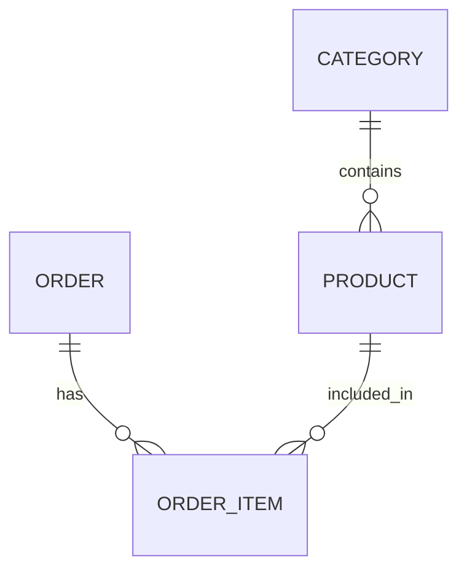

# Лабораторная работа 2 — SQLAlchemy ORM

Проект демонстрирует CRUD для категорий, товаров и заказов, фильтрацию товаров,
а также связи один-ко-многим и многие-ко-многим через таблицу `order_items`.

## Схема базы данных



## Запуск

Из корня репозитория:

```powershell
python -m pip install -r lab2_orm/requirements.txt
python -m lab2_orm.main
```

База `app.db` создаётся рядом с исходными файлами. Демонстрация пересоздаёт её при
каждом запуске, поэтому вывод остаётся повторяемым.

